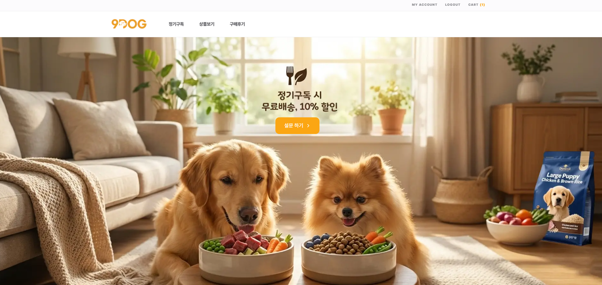
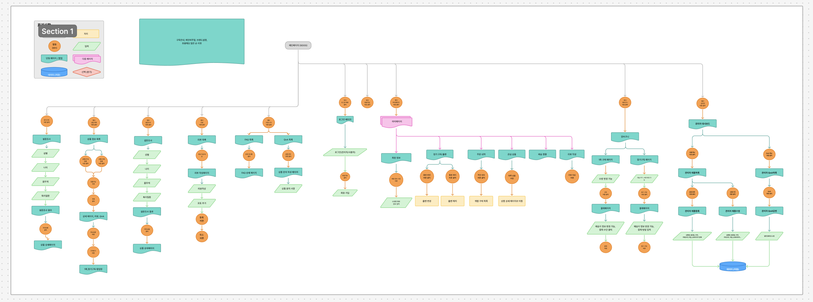

# 9DOG ​🐶​ : 반려견 맞춤 사료 및 간식 정기구독 서비스

> 반려견의 건강과 행복을 위해 설문을 통한 맞춤형 사료 추천 및 정기구독 서비스
> <br/>

 

<h3><b> 건강한 반려견을 위한 최고의 선택 :  9DOG</b></h3>
  
### [ 배포주소 🐕​](https://final-06-gu-dog-release.vercel.app/)

<br/>
<hr/>

## 📢 프로젝트 개요

9DOG은 반려견의 건강과 행복을 위해 설문을 통한 맞춤형 사료 추천 및 정기구독 서비스를 제공하는 웹 프로젝트입니다.

<br/>

## 🌱 주요 기능

### 사용자 경험 (UX) 및 쇼핑 기능 : <br/>

- 맞춤형 제품 추천 설문: 반려견의 특징(나이, 알러지, 활동량 등)을 입력하면 가장 적합한 사료와 간식 매칭

- 정기구독 시스템: 매번 주문할 필요 없이 설정한 주기에 맞춰 자동으로 배송받으며, 마이페이지에서 언제든 플랜을 변경하거나 조정
- 일반 구매: 구독 외에 필요한 제품을 1회성으로 즉시 구매 가능
- 장바구니 및 결제: 관심 있는 상품을 담아두고, 간편하게 결제까지 이어지는 커머스 핵심 기능을 제공

### 마이페이지 및 회원 관리 : <br/>

- 회원 시스템: 이메일 기반의 회원가입 및 로그인을 지원

- 프로필 관리: 회원 정보를 수정하고 반려견의 상태를 업데이트 가능
- 관심 상품(찜): 마음에 드는 상품을 저장하고, 필요 없을 때 자유롭게 삭제하며 관리
- 리뷰 시스템: 구매한 상품에 대해 실사용 후기를 작성하여 다른 사용자들과 정보를 공유

### 관리자(Admin) 전용 기능 : <br/>

- 운영 대시보드: 등록된 상품 수, 답변 대기 중인 문의건, 최신 리뷰 현황 등을 한 화면에서 요약해서 확인
- 상품 관리: 새로운 사료나 간식을 등록하고 기존 제품 정보를 수정할 수 있는 CMS 기능 포함
- CS 고객 지원: 사용자가 남긴 1:1 문의(Q&A)를 확인하고 직접 답변을 달아 관리

<br/>

## 🕒프로젝트 기간

> 2026.01.14~2026.02.13 (총 30일)
> <br/>

<br/>

## 🧑‍🌾 팀원소개

|                                                                   |                                                                  |                                                                   |                                                                       |
| :-----------------------------------------------------------------------------------------------------------------------------------: | :-----------------------------------------------------------------------------------------------------------------------------------: | :-------------------------------------------------------------------------------------------------------------------------------: | :---------------------------------------------------------------------------------------------------------------------------------: |
| 고은별 [](https://github.com/byeolscript) | 문혁진 [](https://github.com/moonhyukjin) | 서주희 [](https://github.com/tjwngml) | 윤소라 [](https://github.com/sooorAyun) |
|                                                             팀장 및 서기                                                              |                                                                  PL                                                                   |                                                          PM 보조 및 발표                                                          |                                                                 PM                                                                  |
|                                                                                                                                       |                                                                                                                                       |                                                                                                                                   |                                                                                                                                     |

<br/>

## ⚙️기술 스택

<div align="center">

| 분류             | 툴                                                                                                                                                                                                                                                                                                                                                                                                                  |
| ---------------- | ------------------------------------------------------------------------------------------------------------------------------------------------------------------------------------------------------------------------------------------------------------------------------------------------------------------------------------------------------------------------------------------------------------------- |
| **기술 스택**    |                                                                                              |
| **UI/UX**        |                                                                                                                                                                                                                                                                                                                  |
| **개발 환경**    |                                                                                                                                                                                           |
| **커뮤니케이션** |     |
| **배포**         |                                                                                                                                                                                                                                                                                                                |

</div>

## ​🎶​ 워크플로우

[워크플로우](https://www.figma.com/board/KkAmnie0PTOGCyPmy1Pax4/6%EC%A1%B0-200-OK?node-id=0-1&t=kuYrKx4Xn8Qei1mE-1)


---

<br/>

## 📁 프로젝트 폴더 구조

```
final-06-GuDog/
├── app/                              # Next.js App Router
│   ├── layout.tsx                    # 루트 레이아웃
│   ├── globals.css                   # 전역 스타일
│   ├── Provider.tsx                  # 전역 Provider
│   ├── error.tsx                     # 에러 페이지
│   ├── not-found.tsx                 # 404 페이지
│   │
│   ├── (main)/                       # 사용자 페이지 그룹
│   │   ├── layout.tsx                # 메인 레이아웃 (Header/Footer)
│   │   ├── page.tsx                  # 홈 페이지
│   │   ├── _components/              # 홈 전용 컴포넌트 (HeroSwiper, FeatureCard 등)
│   │   ├── (auth)/                   # 인증
│   │   │   ├── login/                #   로그인
│   │   │   └── signup/               #   회원가입
│   │   ├── products/                 # 상품
│   │   │   ├── page.tsx              #   상품 목록
│   │   │   ├── _components/          #   Modal, ProductDetail, Skeleton
│   │   │   └── [productId]/          #   상품 상세 / Q&A
│   │   ├── cart/                     # 장바구니
│   │   │   └── _components/          #   일반(Onetime) / 구독(Subscription) 장바구니
│   │   ├── checkout/                 # 결제
│   │   ├── mypage/                   # 마이페이지
│   │   │   ├── _components/          #   EditProfile, Wishlist, ReviewItem, DetailSub 등
│   │   │   ├── (layout)/             #   사이드바 있는 페이지
│   │   │   │   ├── order/            #     주문 내역
│   │   │   │   ├── profile/          #     프로필
│   │   │   │   ├── subscription/     #     구독 관리
│   │   │   │   └── wishlist/         #     찜 목록
│   │   │   └── (no-layout)/          #   사이드바 없는 페이지
│   │   │       ├── order/[orderid]/  #     주문 상세 / 리뷰 작성
│   │   │       └── subscription/[subscriptionId]/ # 구독 상세·수정
│   │   ├── reviews/                  # 리뷰
│   │   │   └── _components/          #   ReviewCard, ReviewList, ReviewStats, ReviewFilters
│   │   ├── survey/                   # 맞춤 추천 설문 / 결과
│   │   └── support/faq/              # FAQ
│   │
│   └── (admin)/                      # 관리자 페이지 그룹
│       ├── layout.tsx                # 관리자 레이아웃
│       └── admin/
│           ├── page.tsx              # 대시보드
│           ├── _components/          # ProductForm, AnswerForm, SearchFilter, StatCard 등
│           ├── products/             # 상품 관리 (목록 / 등록 / 수정)
│           └── qna/                  # Q&A 관리 (목록 / 답변 작성)
│
├── components/                       # 공통 컴포넌트
│   ├── common/                       # Button, Input, Badge, Checkbox, Pagination,
│   │                                 # ProductCard, QuantityControl, StarRating, Tab 등
│   └── layouts/                      # Header, Footer, AdminHeader, AdminSidebar
│
├── actions/                          # Server Actions
│   ├── cart.ts / checkout.ts         # 장바구니 / 결제
│   ├── product.ts / qna.ts          # 상품 / Q&A
│   ├── user.ts / profile.tsx         # 사용자 / 프로필
│   └── uploadfiles.ts               # 파일 업로드
│
├── lib/                              # API 호출 & 유틸리티
│   ├── index.ts / config.ts         # API 공통 설정
│   ├── product.ts / cart.ts / order.ts / user.ts  # 도메인별 API
│   ├── post.ts / bookmark.ts / replies.ts         # 게시글 / 북마크 / 댓글
│   ├── statistics.ts                # 통계
│   ├── recommendProducts.ts         # 상품 추천 로직
│   └── sweetalert.ts               # 알림 유틸
│
├── types/                            # TypeScript 타입 정의
│   ├── product.ts / cart.ts / order.ts / user.ts  # 도메인별 타입
│   ├── review.ts / post.ts / bookmark.ts          # 리뷰 / 게시글 / 북마크
│   ├── response.ts / config.ts / codes.ts         # 공통 타입
│   └── kakao.d.ts                   # 카카오 SDK 타입
│
├── zustand/                          # Zustand 상태 관리
│   ├── useStore.ts                  # 전역 스토어
│   └── useCartStore.ts             # 장바구니 스토어
│
├── hooks/                            # 커스텀 훅
│   └── useUrlParams.ts             # URL 파라미터 훅
│
├── api/dbinit/                       # DB 초기화 샘플 데이터
├── public/                           # 정적 파일 (icons/, images/)
└── .github/                          # GitHub 설정 (이슈 템플릿, PR 템플릿, Actions)

```

## 🖥️ 서비스 소개

<br/>

---

### 🏠 메인 페이지

- Swiper 히어로 배너 자동 슬라이드, "설문 하기" 버튼 클릭 시 설문조사 페이지로 이동
- 서비스 소개 카드 3종: 반려견 정보 입력, AI 건강 분석, 정기 배송 관리
- 베스트 상품 3개 표시, "상세 정보" 클릭 시 상품 상세 페이지로 이동
- 혜택 소개 3종: 실시간 영양 최적화, 맞춤 영양 솔루션, 신선한 원재료
- 공통 헤더: 내비게이션(정기구독, 상품보기, 구매후기), 장바구니 배지, 로그인 상태별 링크 전환, 모바일 드로어 메뉴
- 공통 푸터: 고객센터 정보, 이용약관/개인정보처리방침 링크, 회사 정보

|                                                |                                             |
| ---------------------------------------------- | ------------------------------------------- |
|  |  |

### ✔️​ 설문 페이지

- 4단계 설문 폼: 기본 정보(크기/나이/중성화) → 생활 패턴(활동량/체형) → 건강 상태(알러지/건강 고민) → 선호도(단백질/곡물)
- 각 단계별 필수 항목 미선택 시 다음 버튼 비활성화, 이전/다음 버튼으로 단계 이동
- 마지막 단계에서 "분석 중..." 로딩 후 결과 페이지로 이동
- 선택 조건 태그 및 1위 추천 상품 대형 카드 표시, "제품 상세보기" 클릭 시 상품 상세 페이지로 이동
- 영양 전문가 추천 사유 3가지 및 영양 균형 리포트(단백질/지방/칼로리/수분) 표시
- 2~5위 추천 상품 카드 리스트, "전체 상품 구경하기" / "설문 다시하기" 버튼

|                                               |                                            |
| --------------------------------------------- | ------------------------------------------ |
|  |  |

### 🔐 로그인 페이지

- 로그인 기능: 사용자 계정 인증 및 세션 관리
- 유효성 검증: 아이디 및 비밀번호 실시간 유효성 체크
- 로그인 정보 저장: 자동 로그인 또는 아이디 기억하기 기능 구현

|                                                    |                                             |
| -------------------------------------------------- | ------------------------------------------- |
|  |  |

### 🍳 회원가입 페이지

- 회원가입: 신규 사용자 등록 프로세스 구축

|                                                           |                                                  |
| --------------------------------------------------------- | ------------------------------------------------ |
|  |  |

---

### 💡 상품 목록 페이지

- 헤더 메뉴 > 상품보기 > 사료/간식 카테고리를 구분하여 클릭 시 해당 상품 목록만 노출
- 견종의 연령대(퍼피/성견/시니어) 필터링 하는 기능 구현
- 페이지네이션 적용
  - 한 페이지씩 12개의 상품 노출
  - 첫페이지에서는이전 버튼 비활성화
  - 마지막페이지 다음버튼 비활성화
- 로딩 시 스켈레톤 ui로 로딩 상태 처리

|                                                            |                                                   |
| ---------------------------------------------------------- | ------------------------------------------------- |
|  |  |

---

### ​​👀​ 상품 상세 페이지

- 구매하기 버튼 클릭 시 모달창 오픈
- 관심상품(하트 버튼) 토글 기능
  - 클릭 시 관심상품을 등록/삭제
  - 마이페이지 관심상품에 추가 기능
- 탭 네비게이션 스크롤 기능
  - 상세정보/ 리뷰 / qna 클릭 시 해당 영역으로 스크롤 이동
- 상세더보기 토글 기능
  - 클릭 시 상세설명 열림/닫힘 기능
- 리뷰 & Q&A 목록
  - 페이지당 5개 게시물 노출
  - 첫/마지막 페이지에서 이전/다음 버튼 비활성화
- 리뷰 필터 기능
  - 최신순/사진 후기만 보기 필터
- Q&A 기능
  - 아코디언 형식으로 문의 내용 열기/닫기 가능
  - 관리자가 답변 작성 시
    - 상태 태그: 답변 대기 → 답변 완료 변경
    - 문의 내용 하단에 관리자 답변 노출
  - “문의 작성하기” 클릭 시 작성 페이지로 이동 후 등록 가능

|                                                              |                                                      |
| ------------------------------------------------------------ | ---------------------------------------------------- |
|  |  |

---

### 🛒 구매 모달창

- 모달창 이외 배경/X버튼/상단의 가로 바 클릭 시 모달 창 닫힘,
- 구매 방법 탭 전환(1회구매/ 정기구독)
- 정기구독 탭에서 배송주기(2주/4주) 선택 가능
- 정기구독 구매 시 10% 할인 자동 적용
- 상품의 수량 조절 기능
- 상품 선택 후 장바구니 버튼 클릭 시 1회 구매와 정기구독으로 구분하여 장바구니에 담김
- 상품 선택 후 바로 구매하기 클릭 시 결제 페이지로 이동

|                                                               |                                                   |
| ------------------------------------------------------------- | ------------------------------------------------- |
|  |  |

---

### 🛒 장바구니 페이지

- 1회 구매, 정기 구독 탭 클릭 시 해당 탭으로 이동
- 수량 버튼 클릭 시 제품 갯수 및 상품 금액, 총 금액 변경
- 선택 삭제 / 삭제 버튼 클릭 시 해당 상품 삭제
- 개별 선택 및 전체 선택 버튼 클릭 시 선택 삭제 및 선택 구매 가능
- 정기 구독 탭에서 배송 주기 변경 가능
- 구매하기 버튼 클릭 시 결제페이지로 이동

|                                                    |                                                    |
| -------------------------------------------------- | -------------------------------------------------- |
|  |  |

---

### ​​✅​ 결제 페이지

- 주문 상품의 건 수 및 배송 주기 확인 가능
- 주소 찾기 클릭 시 배송지 정보 변경
- 결제하기 버튼 클릭 시 결제 창 연동 및 결제 후 마이페이지 주문 내역 페이지로 이동
- 장바구니 돌아가기 클릭 시 장바구니 페이지로 이동

|                                               |                                             |
| --------------------------------------------- | ------------------------------------------- |
|  |  |

---

### 👤 마이페이지

- 회원 정보 수정: 프로필 이미지 업로드 및 변경.
- 배송지 관리: 기본 배송지 및 추가 배송 정보 수정 기능.
- 구독 현황 조회: 현재 정기구독 중인 상품 목록 및 주문 일자 확인.
- 플랜 변경: 배송 주기 전환 기능 (2주 ↔ 4주 간 자유로운 변경).
- 배송 스케줄링: 사용자 편의에 따른 다음 배송 희망일 지정 기능.
- 주문 내역 조회: 과거 주문 건들에 대한 상세 내역 및 주문 일자 열람.
- 구매 상품에 대한 리뷰 작성 기능.
- 작성 여부에 따른 상태 관리 (작성 전/작성 완료 분기 처리).
- 상품 상세/목록에서 관심 상품 추가 시 마이페이지 목록 업데이트.
- 관심 상품 목록 내 실시간 삭제 기능.

|                                                             |                                                         |
| ----------------------------------------------------------- | ------------------------------------------------------- |
|  |  |

---

### 👤 구매 후기 목록 페이지

- 평균 별점 및 총 후기 수 통계 표시
- 별점 필터: 전체 / 1점 / 2점 / 3점 / 4점 / 5점
- 정렬: 최신순 / 오래된순
- 후기 카드 그리드 표시 (모바일 1열, 태블릿 2열, 데스크탑 3열)
- 각 카드: 후기 이미지, 별점 배지, 제목, 내용 미리보기, 구매 상품 정보, 작성자, 작성일
- 구매 상품 정보 클릭 시 상품 상세 페이지(`/products/{id}`)로 이동
- 페이지당 6건 표시, 페이지네이션 지원
- 필터 결과 없을 시 빈 상태 메시지 표시
- API 오류 시 에러 메시지 및 재시도 버튼 표시
- 로딩 중 스켈레톤 UI 표시

|                                                      |                                                   |
| ---------------------------------------------------- | ------------------------------------------------- |
|  |  |

---

### 🍉​​​​ 관리자 페이지 - 대시보드

- 통계 카드 5개 표시: 총 판매금액, 총 주문건수, 총 회원수, 답변 대기, 재고 부족
- 답변 대기 QnA 최근 4건 표시 (경과 시간별 색상 배지: 0-12h 노랑, 12-24h 주황, 24h+ 빨강)
- 각 QnA 항목에서 "답변하기" 버튼 클릭 시 답변 페이지로 이동
- "전체보기" 클릭 시 QnA 목록 페이지로 이동
- 재고 부족 상품 최근 5건 표시 (재고 0: 빨강, 1-100: 주황 배지)
- 각 재고 부족 상품 클릭 시 상품 수정 페이지로 이동
- "전체보기" 클릭 시 상품 목록 페이지로 이동
- 최근 주문 내역 5건 테이블 표시 (주문번호, 고객명, 상품명, 금액, 상태, 주문일)

|                                                  |                                               |
| ------------------------------------------------ | --------------------------------------------- |
|  |  |

### ​🍊​​​ 관리자 페이지 - 상품 목록

- 통계 카드 3개 표시: 전체 상품 수, 재고 부족(≤100), 품절(0)
- 상품명 키워드 검색 (입력 후 Enter 또는 검색 버튼 클릭)
- 카테고리 필터: 전체 / 사료 / 간식
- 정렬: 최신순, 상품명 오름차순/내림차순, 코드명 오름차순/내림차순, 가격 높은순/낮은순
- 상품 테이블 표시: ID, 상품명, 카테고리(사료: 파랑 배지, 간식: 보라 배지), 코드명, 재고, 등록일, 수정 버튼
- 재고 상태별 색상: 품절(빨강), 부족(주황), 충분(초록)
- "수정" 버튼 클릭 시 해당 상품 수정 페이지로 이동
- 페이지네이션 (이전/다음 버튼, 페이지 번호, 총 건수 표시)

|                                                  |                                               |
| ------------------------------------------------ | --------------------------------------------- |
|  |  |

### ​🍑​​ 관리자 페이지 - 상품 등록

- 기본 정보 입력: 상품명, 코드명, 가격(원), 재고 수량, 중량(g), 상품 설명, 라인 태그
- 썸네일 이미지: 단일 이미지 업로드
- 상세 이미지: 다중 이미지 업로드, 개별 삭제 가능
- 매칭 정보 (사료 전용): 생애주기, 견종 크기, 중성화 여부, 체형, 활동량, 주요 단백질, 그레인프리 여부, 건강 효능, kcal/100g, 영양 정보(조단백/조지방/수분), 포함/제외 성분, 알러지 제외, 질병 제외, 특수 기능
- 필수 항목 미입력 시 유효성 검사 오류 표시
- "등록" 버튼 클릭 시 상품 등록 후 상품 목록 페이지로 이동 및 성공 토스트 표시

|                                                    |                                                 |
| -------------------------------------------------- | ----------------------------------------------- |
|  |  |

### ​​🥑​​ 관리자 페이지 - 상품 수정

- 기존 상품 데이터 자동 로드 및 폼에 사전 입력
- 기존 이미지에 "기존" 배지 표시, 삭제 및 새 이미지 추가 가능
- 재고 수량: 남은 재고(전체 - 판매량)로 표시, 판매량 별도 안내
- 수정 시 입력한 재고 + 판매량으로 총 재고 재계산
- "수정" 버튼 클릭 시 상품 수정 후 상품 목록 페이지로 이동 및 성공 토스트 표시

|                                                  |                                               |
| ------------------------------------------------ | --------------------------------------------- |
|  |  |

### ​🍎​​​​ 관리자 페이지 - qna 목록

- 통계 카드 3개 표시: 전체 문의, 답변 완료, 답변 대기
- 문의 제목 키워드 검색 (입력 후 Enter 또는 검색 버튼 클릭)
- 상태 필터: 전체 / 답변 완료 / 답변 대기
- 정렬: 최신순, 제목 오름차순/내림차순
- QnA 테이블 표시: ID, 문의 제목, 작성자, 상태(답변 완료: 초록 배지, 답변 대기: 주황 배지), 작성일, 액션 버튼
- "답변하기" 또는 "답변수정하기" 클릭 시 답변 페이지로 이동
- 페이지네이션 (이전/다음 버튼, 페이지 번호, 총 건수 표시)

|                                                      |                                                   |
| ---------------------------------------------------- | ------------------------------------------------- |
|  |  |

### ​​​🍒​​​ 관리자 페이지 - qna 답변

- 문의 내용 표시: 상태 배지, 제목, 본문, 작성자, 작성일
- 관련 상품 정보 표시: 상품 이미지, 상품명, 코드명, 가격 / "상품 상세보기" 클릭 시 상품 상세 페이지로 이동
- 고객 정보 표시: 이름, 문의 번호, 문의 날짜
- 답변 작성 텍스트 영역 (최대 1,000자, 글자 수 카운터 표시)
- 빠른 답변 템플릿 3종: 일반 문의 / 경미한 불편 / 불편·클레임 (클릭 시 템플릿 자동 입력)
- "답변 등록" 또는 "답변 수정" 버튼 클릭 시 답변 저장 후 QnA 목록 페이지로 이동 및 성공 토스트 표시
- 답변 수정 모드에서 "답변 삭제" 버튼 클릭 시 확인 모달 표시 후 삭제
- 뒤로가기 버튼 클릭 시 이전 페이지로 이동

|                                                            |                                                         |
| ---------------------------------------------------------- | ------------------------------------------------------- |
|  |  |

<br/>

<br/>

---

<br/>

## 🐞 트러블슈팅

<table>
  <thead>
    <tr>
      <th style="width: 100px;">이름 👤</th>
      <th>❗ 문제점</th>
      <th>🛠️ 해결 사례</th>
    </tr>
  </thead>
  <tbody>
    <tr>
      <td>은별</td>
      <td> dev 브랜치를 최신화하지 않은 상태에서 PR을 올려 <br/> 그 상태로 merge가 되면서 일부 파일이 <br/> 이전 버전으로 덮어씌워지는 문제가 발생. <br/>
</td>
      <td>팀원들과 보조강사님께 도움을 받아 <br/> 커밋 내역 확인 후 최신으로<br/>  정상동작하던 커밋으로 되돌림.</td>
    </tr>
    <tr>
      <td>혁진</td>
      <td>상품 수정 시 기존 서버 이미지(URL path)와 새로  <br/> 업로드한 이미지(File 객체)의 데이터 구조가 <br/>달라 하나의 배열에서 렌더링·삭제·제출 <br/>시점마다 구분할 수 없었고, createObjectURL로<br/> 생성한 blob URL을 해제하지 않아<br/> 이미지 추가·삭제를 반복할수록 브라우저 <br/>메모리가 누적되는 문제가 발생</td>
      <td> ImageItem 타입을 NewImageFile과 ExistingImage의<br/> Discriminated Union(type: "new" | "existing")으로 <br/>설계하여 렌더링 시 미리보기 URL 분기,<br/> 제출 시 File과 path 자동 분리, 삭제 시 새 <br/>이미지만 선별하여 revokeObjectURL로 blob을 즉시 <br/>해제하는 구조로 메모리 누수를 방지</td>
    </tr>
    <tr>
      <td>주희</td>
      <td>Zustand의 persist나 브라우저의 Cookie를 이용해  <br/>로그인 상태를 관리하던 중, 페이지 새로고침 시  <br/>화면이 깜빡이거나 "Text content did not match..."  <br/>또는 "Hydration failed" 에러가 발생함.</td>
      <td>서버와 클라이언트의 초기 렌더링 결과를 강제로 일치시킨 뒤,  <br/>클라이언트 마운트 완료 후에만 상태를  <br/>업데이트하도록 로직 수정.</td>
    </tr>
    <tr>
      <td>소라</td>
      <td>결제 완료 후 Zustand 상태만 업데이트하고 <br/> 서버 데이터는 삭제되지 않아  장바구니 <br/>  페이지에 상품이 그대로 남는 문제 발생</td>
      <td>결제 성공 시 deleteCartItems 서버 액션을 <br/> 먼저 호출해 서버 데이터 삭제 후 <br/> Zustand 상태 업데이트하도록 수정</td>
    </tr>
  </tbody>
</table>

## 💪 챌린지

- 🩷 고은별 : <br/> 전체적인 기능 흐름을 설계하고 디자인하는 것부터, 내가 맡은 주요 기능들까지 끝까지 <br/>
  개발하는 과정이 가장 큰 챌린지였습니다. 제가 맡은 페이지 안에서 모달창과 필터링을 처음 직접 <br/>
  구현해보면서 여러 기능들을 연결하는 부분이 쉽지 않았습니다. 이해되지 않는 부분들은 혼자 고민하기보단 <br/>
  PL과 팀원들과 계속 소통하며 방향을 맞춰 나갔습니다. 기능 구현 중 발생한 충돌이나 구조적인 고민도 함께 논의하며 <br/>
  해결했고, 그 결과 기한 내에 핵심 기능을 모두 구현할 수 있었습니다.

- 🧡 문혁진 : <br/> 사용자 화면뿐 아니라 관리자용 어드민 페이지(대시보드, 상품 CRUD, QnA 관리)를 <br/>
  설계하고 구현했습니다. 상품 등록/수정 폼에서는 15개 이상의 입력 필드가 <br/>
  3단계 중첩 객체로 구성되어 있어 use-immer를 도입해 상태 업데이트를 개선했고, <br/>
  서버 이미지와 새 업로드 이미지를 Discriminated Union 타입으로 구분하여 안전하게 처리했습니다.

- 💛 서주희 : <br/> 단순 텍스트 리뷰가 아니라 이미지 파일을 포함한 멀티파트(Multipart) 데이터를 처리해야 했다.<br/>
  특히 미리보기 이미지는 보여주면서 실제 파일 객체는 따로 관리하여 서버 액션으로 넘겨주는 과정이 까다로웠다. <br/>

- 💚​ 윤소라 :<br/>
  이번 프로젝트에서 Zustand를 활용한 전역 상태 관리와 PortOne 결제 SDK 연동을 처음으로 도전했다. <br/>
  특히 서버와 클라이언트 상태를 동기화하는 로직을 직접 설계하고 구현해보면서 단순한 기능 구현을 넘어 데이터 흐름 전체를 고민하는 경험을 할 수 있었다.

## 💫​​ 회고

- 🩷 고은별 :
  <br/>
  이번 프로젝트를 하면서 기획부터 디자인, 개발까지 전 과정을 직접 겪어보니 개발만 어려운 게 <br/>
  아니라 그 앞 단계들도 절대 쉽지 않다는 걸 느꼈습니다. 짧은 시간 안에 기준을 잡는 게 쉽지는 않았지만,<br/>
  그 과정을 거쳤기 때문에 기능을 구현할 때 전체 흐름을 더 빨리 이해할 수 있었습니다. <br/>
  상품 목록, 상세 페이지, 구매 모달을 만들면서 파일 구조를 어떻게 잡아야 하는지, <br/>
  컴포넌트를 어떻게 나눠서 재사용해야 하는지도 더 배울 수 있었습니다. 그리고 이번에도 Git은 쉽지 않았지만, <br/>
  push 전에 git pull origin dev를 왜 꼭 해야 하는지 제대로 알게 되었습니다. <br/>
  바닐라 프로젝트 때와는 다르게 기능만 만드는 게 아니라 전체 과정을 거쳐 프로젝트를 완성해봤다는 점에서 더 의미 있었던 경험이었습니다.

- 🧡​ 문혁진 : 본 프로젝트를 통해 기획부터 프론트엔드 개발, QA까지 서비스 제작 전 과정을 경험하며,<br/>
  개발 흐름에 대한 큰 틀을 이해할 수 있었습니다. 특히 API 연동 과정을 직접 구현하며 <br/>
  데이터 요청과 응답 구조를 파악했고, 이를 바탕으로 화면 구현을 넘어 서비스 구조와 사용자 흐름을 <br/>
  함께 고려하는 관점을 기를 수 있었습니다. 또한 프로젝트 초반에 TypeScript를 활용해 <br/>
  공통 타입과 데이터 구조를 정의하고 공유하면서, 팀원 간 작업 방식의 차이를 줄일 수 있었습니다.<br/>
  그 결과 이후 기능 추가와 수정 작업을 효율적으로 진행할 수 있었고, 초기 구조 설계의 중요성을 직접 느낄 수 있었습니다.

- 💛 서주희​ : 처음에는 Next.js의 서버/클라이언트 컴포넌트 구조와 Zustand의<br/>
  상태 유지가 얽혀 혼란스럽기도 했다. 특히 토큰을 어디서 추출하고 어떻게 저장해야 할지<br/>
  고민하며 많은 시간을 보냈지만 이 과정을 통해 데이터의 흐름을 추적하는 능력을 키울 수 있었다.<br/>
  단순히 기능을 만드는 것을 넘어 사용자가 시점에서 고민하고 또 어떤 정보를 놓치기 쉬운지<br/>
  고민하며 개발하는 즐거움을 알게 된 프로젝트였다.

- 💚​ 윤소라 :
  <br/>

  이번 프로젝트에서 장바구니와 결제 기능을 담당하면서 단순히 화면을 구현하는 것을 <br/>
  넘어 서버와 클라이언트 상태를 어떻게 동기화할지 깊이 고민하게 되었다. Zustand를 처음 본격적으로 <br/>
  사용해보면서 전역 상태 관리의 편리함을 느꼈지만, 서버 데이터와의 싱크를 맞추는 과정에서 생각보다 많은 <br/>
  예외 상황이 발생했다. 결제 완료 후 장바구니가 삭제되지 않거나, 상태 업데이트 타이밍 때문에 빈 화면이 <br/>
  순간적으로 보이는 등의 문제를 겪으며 비동기 처리와 렌더링 순서의 중요성을 몸소 깨달았다. 또한 컴포넌트를 <br/>
  사용하면서 팀원의 코드를 분석하고 재사용하는 과정에서 코드의 일관성과 협업의 중요성도 배울 수 있었다. <br/>
  아쉬운 점은 상태 관리가 아직 어렵게 느껴져 로직이 깔끔하지 못한 부분이 있다는 것이다. <br/>
  앞으로도 모자란 부분에 대해 꾸준히 공부하며 더 나은 코드를 작성할 수 있게 발전하고 싶다.

<br/>

---

<br/>
